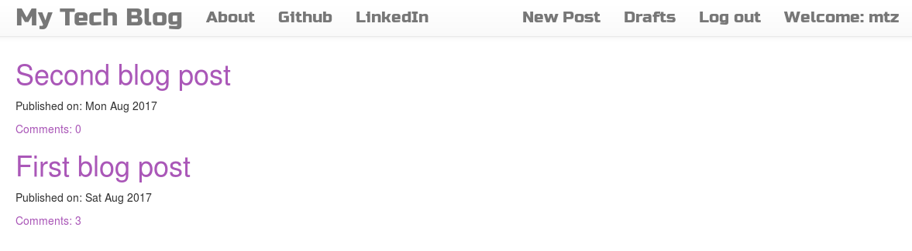
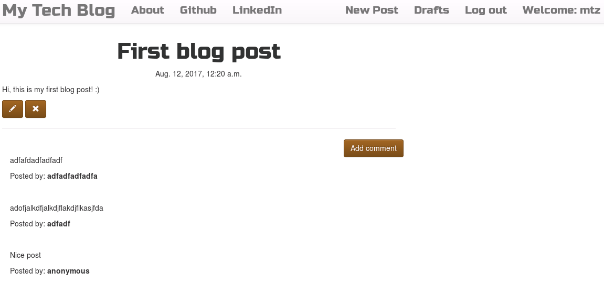

## Synopsis

This directory contains simple blog website created to learn more about Django.

***

***

## Installation

Clone the repository and install miniconda (https://conda.io/docs/intro.html)

Import environment.yml file to get the conda environment with the dependencies for this blog:

`conda env create -f environment.yml`

Activate the conda env:

`source activate blogenv`

Run the site (from within the folder that has manage.py):

`python manage.py runserver`
